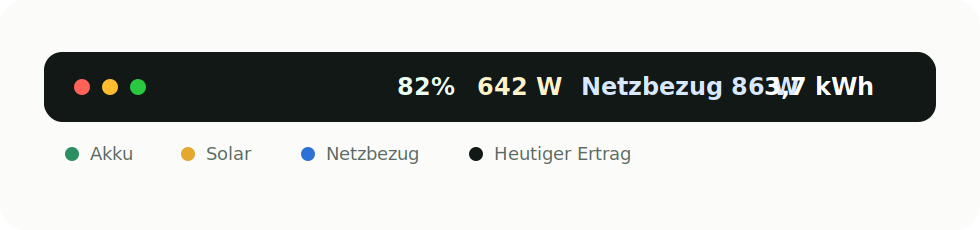
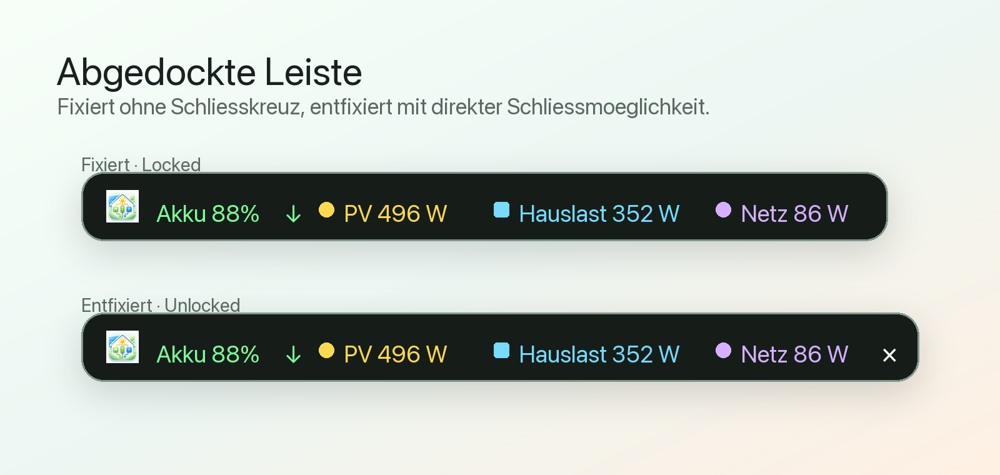
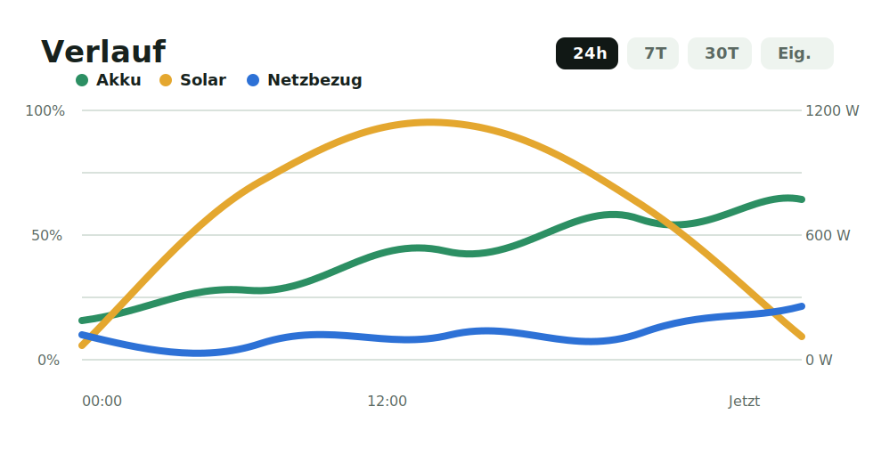

# SolixBar

SolixBar ist eine native macOS-Menueleisten-App fuer Anker SOLIX Uebersichtsdaten.

Sie zeigt Akku, PV, Hauslast, Netzbezug, Energiefluss und Ertrag direkt in der Menueleiste, mit modernem Dashboard, abgedockter schmaler Leiste und Verlaufsgraf.

English: SolixBar is a native macOS menu bar app for Anker SOLIX overview data. It provides a compact menu bar readout, a modern dropdown dashboard, a detachable slim bar, and a history graph.

Die Projekt-Homepage liegt in [`docs/`](docs/) und kann mit GitHub Pages veroeffentlicht werden.

English: Project homepage files are in [`docs/`](docs/) and can be published with GitHub Pages.

## Screenshots / Screenshots







## Funktionen / Features

- Native AppKit-Menueleisten-App. / Native AppKit menu bar app.
- Demo-Modus zum Testen ohne Zugangsdaten. / Demo data mode for testing without credentials.
- Direkter SOLIX-Login sowie Live-Daten ueber lokalen JSON-Befehl oder JSON-URL. / Direct SOLIX login plus live data via local JSON command or JSON URL.
- Frei waehlbare Menueleistenwerte, Bezeichnungen, Symbole, App-Symbol und Skalierung. / Configurable menu bar values, labels, symbols, app icon visibility, and scaling.
- Optionale farbige Energiefluss-Pfeile in der Menueleiste. / Optional colored energy-flow arrows in the menu bar.
- Abgedockte schmale Leiste mit Andocken-Funktion, Fixieren gegen versehentliches Verschieben und gespeichertem Zustand. / Detachable slim bar with dock action, optional movement lock, and restored state.
- Hell, Dunkel oder automatisch passend zum System. / Light, dark, or automatic system appearance.
- Deutsche oder englische sichtbare App-Texte. / German or English visible app text.
- Login-Autostart. / Login autostart support.
- Aufklapp-Dashboard mit Akku, PV, Hauslast, Netzbezug, Akku-Fluss, Tagesertrag, Gesamtertrag und Status. / Dropdown dashboard with battery, solar, home load, grid import, battery flow, daily yield, total yield, and status.
- Animierter Verlaufsgraf fuer Akku, Solar und Netzbezug. / Animated history graph for battery, solar, and grid import.
- Zeitraeume: Aktuell, 24 Stunden, 7 Tage, 30 Tage und individuell. / Graph ranges: current, 24 hours, 7 days, 30 days, and custom.
- Sichtbare Fragezeichen-Hilfen in den Einstellungen. / Visible question-mark help controls in settings.
- Lokale Logdatei fuer Fehleranalyse: `~/Library/Application Support/SolixBar/SolixBar.log`. / Local log file for troubleshooting.

## Version / Version

Aktuelle Version / Current version: `0.4.1`

Versionshinweise stehen in [CHANGELOG.md](CHANGELOG.md). / See [CHANGELOG.md](CHANGELOG.md) for release notes.

## Voraussetzungen / Requirements

- macOS 14 oder neuer. / macOS 14 or newer.
- Das fertige Release benoetigt weder Python noch Xcode. / The packaged release requires neither Python nor Xcode.
- Nur fuer lokale Quellcode-Builds: Swift-Toolchain oder Xcode Command Line Tools. / Source builds only: Swift toolchain or Xcode Command Line Tools.

## Bauen und Starten / Build and Run

Direkt mit SwiftPM starten. / Run directly from SwiftPM:

```bash
swift run SolixBar
```

App-Bundle zum Doppelklicken erstellen. / Create a double-clickable app bundle:

```bash
sh scripts/package_app.sh
unzip outputs/SolixBar-0.4.1-macOS-arm64.zip -d outputs
open outputs/SolixBar.app
```

Das Paket-Skript erwartet die lokale, nicht eingecheckte Python-Laufzeit unter `work/`; die veroeffentlichte ZIP-Datei enthaelt sie bereits. / The packaging script expects the local, untracked Python runtime below `work/`; the published ZIP already includes it.

## Datenquellen / Data Source Modes

SolixBar unterstuetzt vier Modi. / SolixBar supports four modes:

- `SOLIX Login`: direkter Abruf mit in der macOS-Keychain gespeicherten Zugangsdaten. / Direct fetch with credentials stored in the macOS Keychain.
- `Demo`: erzeugte Beispieldaten zum Testen der Oberflaeche. / Generated sample data for testing the UI.
- `Lokaler JSON-Befehl`: fuehrt einen lokalen Befehl aus und liest JSON aus stdout. / Runs a local command and reads JSON from stdout.
- `JSON-URL`: laedt JSON von einer lokalen oder entfernten HTTP-Adresse. / Fetches JSON from a local or remote HTTP endpoint.

Das JSON sollte so aussehen. / The JSON should look like this:

```json
{
  "siteName": "Anker SOLIX",
  "batteryPercent": 82,
  "solarWatts": 642,
  "homeWatts": 318,
  "gridWatts": -86,
  "batteryWatts": 238,
  "todayKWh": 3.74,
  "totalKWh": 427.8,
  "status": "Online",
  "updatedAt": "2026-07-06T19:30:00Z"
}
```

## Live SOLIX Daten / Live SOLIX Data

Anker stellt keine stabile oeffentliche SOLIX API bereit. SolixBar 0.4.1 liefert den benoetigten Python-Helper und seine Laufzeit im App-Bundle mit. Fuer den normalen SOLIX-Login sind keine Projektordner, Terminalbefehle oder persoenlichen Dateipfade mehr erforderlich.

English: Anker does not provide a stable public SOLIX API. SolixBar 0.4.1 bundles the required Python helper and runtime inside the app. Normal SOLIX login no longer requires a project checkout, Terminal commands, or personal file paths.

Oeffne `Einstellungen` -> `Datenquelle`, waehle `SOLIX Login`, trage Mail,
Passwort und Land ein und druecke `Speichern`. Mail und Passwort werden in der
macOS-Keychain gespeichert. Verlauf, API-Cache und lokale Ertragswerte liegen
im Application-Support-Ordner der App.

English: Open `Settings` -> `Data Source`, choose `SOLIX Login`, enter email,
password, and country, then press `Save`. Email and password are stored in the
macOS Keychain. History, API cache, and local yield state live in the app's
Application Support folder.

Du kannst jederzeit zu `Demo` oder `JSON-URL` wechseln; SolixBar zeigt nur die
Felder an, die fuer den gewaehlten Modus notwendig sind.

English: You can still switch back to `Demo` or `JSON-URL`; SolixBar only shows
the fields needed for the selected mode.

Der separate Modus `Lokaler JSON-Befehl` bleibt fuer fortgeschrittene eigene Datenquellen erhalten.

English: The separate `Local JSON Command` mode remains available for advanced custom data sources.

## Repository-Hinweise / Repository Notes

Das Repository schliesst lokale Build-Produkte, gepackte Apps, Python-Laufzeiten und heruntergeladene API-Checkouts bewusst aus.

English: The repository intentionally excludes local build products, packaged apps, Python runtimes, and downloaded API checkouts.
